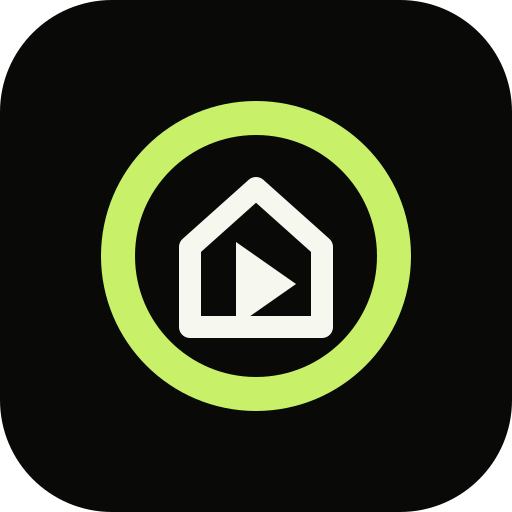

# Kinosail for Home Assistant

This custom integration connects Home Assistant directly to a local [Kinosail](https://github.com/Kinosail/kinosail) Server.

It provides:

- Kinosail Library Content in Home Assistant's media browser.
- Short-lived direct playback URLs. Home Assistant does not relay media.
- `media_player` entities for active Kinosail browser players.
- Play, pause, stop, seek, volume, mute, and play-media controls.
- Automatic local discovery and Owner approval in a secure browser popup.
- A one-time pairing code fallback with the same revocable integration-only token.

## What you need

- A running Kinosail Server with **Home Assistant** enabled in **Settings → Access → Integrations**.
- Home Assistant **2026.9.0 or newer**, able to reach your Kinosail Server over your local network.
- [HACS](https://www.hacs.xyz/docs/use/download/download/) installed in Home Assistant, or use the manual installation below.

This repository contains an integration that runs **inside Home Assistant**. You do not run it as a separate app, service, or Docker/Podman container. Your Kinosail Server and Home Assistant remain separate applications. HACS downloads and updates the integration; it does not replace either application.

## Install with HACS

Until Kinosail is approved for the default HACS store, add it as a custom repository:

1. Open **HACS** in Home Assistant.
2. Open the menu in the upper-right corner and select **Custom repositories**.
3. Enter `https://github.com/Kinosail/kinosail-home-assistant`, choose **Integration**, and select **Add**.
4. Search HACS for **Kinosail**, open it, and select **Download**.
5. Restart Home Assistant to load the integration.

Once Kinosail is listed in the default HACS store, start by searching HACS for **Kinosail**; adding a custom repository will no longer be necessary.

## Connect to Kinosail

1. In Kinosail, open **Settings → Access → Integrations** and enable **Home Assistant**.
2. Select **Add to Home Assistant**, or open Home Assistant's **Settings → Devices & services → Add integration** and search for **Kinosail**.
3. Select the discovered Server or enter its URL. Keep certificate verification enabled when the Server uses a trusted certificate; disable it only for your known Server's private certificate.
4. Approve the connection in the Kinosail Owner approval popup. Alternatively, enter the one-time pairing code from Kinosail Settings.
5. Open Home Assistant's **Media** browser and choose **Kinosail** to browse Library Content. Active Kinosail browser players appear as `media_player` entities for playback controls.

HACS installation and the connection setup are separate steps. If Kinosail does not appear under **Add integration**, confirm the HACS download completed and restart Home Assistant. If the Server is not discovered, enter its URL manually and check that Home Assistant can reach it.

Home Assistant also offers enabled Kinosail Servers that it discovers through local mDNS. Enter the Server URL when multicast discovery cannot cross the container network. The one-time code in Kinosail Settings remains a manual fallback.

Discovery verifies a trusted Kinosail certificate. It uses the confirmed local connection without certificate validation for Kinosail's private certificate. Manual setup keeps this choice visible.

Existing connections keep their approved address and certificate setting when discovery runs again. If the Server moves, use **Reconfigure** on the Kinosail integration to update the connection.

Disabling Home Assistant in Kinosail withdraws mDNS discovery and the API. It also revokes every Home Assistant token.

## Manual install

Download the latest [release](https://github.com/Kinosail/kinosail-home-assistant/releases/latest) and extract the contents of `kinosail.zip` into `<config>/custom_components/kinosail/`, where `<config>` is the directory containing Home Assistant's `configuration.yaml`. The resulting path must include `custom_components/kinosail/manifest.json`. Restart Home Assistant, then follow **Connect to Kinosail** above. For a Home Assistant Container installation, `<config>` is its existing `/config` volume; no additional container is needed.

## Privacy boundary

Kinosail stays the media origin. This integration polls only active player state and library data. It does not use a cloud service, MQTT broker, media proxy, or sidecar.
